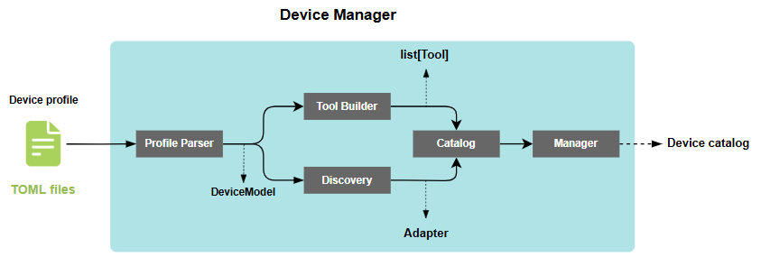

# Device Manager — Thiết kế module

> **Module:** `device_manager/`
> **Phiên bản:** 1.0
> **Ngày:** 09/06/2026

---

## 1. Tổng quan

### Mục đích

`device_manager` là module chịu trách nhiệm duy nhất cho toàn bộ vòng đời của thiết bị:

- Đọc cấu hình thiết bị từ file TOML
- Xây dựng MCP tool catalog cho LLM
- Quản lý kết nối (connect/disconnect) đến thiết bị qua protocol adapter
- Routing tool call từ AI agent đến đúng thiết bị
- Kiểm tra sức khỏe thiết bị định kỳ

### Vị trí trong hệ thống

`device_manager` được khởi tạo bởi `AgriMeshAIServer` tại startup.
Dùng bởi `RuleEngine`, `NotifierManager`, `FleetTools`.

### Ràng buộc thiết kế

- Async toàn bộ I/O — `asyncio`
- Thread-safe — per-device lock
- Error collection thay vì fail-fast
- Không phụ thuộc cloud

---

## 2. Kiến trúc

### Các thành phần

```
device_manager/
├── model.py             7 Pydantic models
├── profile_parser.py    TOML → DeviceModel
├── tool_builder.py      DeviceModel → MCP Tool[]
├── discovery.py         DeviceModel → Adapter + DiscoveredDevice
├── catalog.py           DeviceCatalog (hợp nhất)
├── manager.py           DeviceManager (public API)
└── device_profiles/     TOML config files
```

### Luồng dữ liệu



```
file.toml → profile_parser → DeviceModel
    ├── tool_builder → Tool[]
    └── discovery → Adapter + DiscoveredDevice
    │
    ▼
catalog.DeviceCatalog.from_profiles_dir() → DeviceCatalog
    │
    ▼
manager.DeviceManager() → connect_all → call_tool → health_check
```

---

## 3. Các thành phần

### 3.1 model.py — Định nghĩa dữ liệu

7 Pydantic models:

| Class | Trường chính |
|-------|-------------|
| `DeviceConfig` | `name, description, handler` |
| `ConnectionConfig` | `protocol, port, baud_rate, timeout_ms` — `extra=llow\` |
| `ToolDefinition` | `name, description, command, params, returns` |
| `ToolParam` | `type, min, max, required, default` |
| `ToolReturns` | `type, unit` |
| `HealthConfig` | `check_command, expected, interval_ms` |
| `RecordingConfig` | `enabled, poll_interval_ms` |

### 3.2 profile_parser.py — TOML → DeviceModel

```python
def parse_profile(path: Path) -> DeviceModel
def parse_profile_string(content: str, source: str | None = None) -> DeviceModel
class ProfileError(Exception)
```

**Thiết kế:** Tách đọc file và parse string để dễ test.
Dùng `tomllib` / `tomli` — zero dependency.
Validation bằng Pydantic.

### 3.3 tool_builder.py — DeviceModel → MCP Tool[]

```python
def generate_tools(model: DeviceModel) -> list[Tool]
```

Namespacing: `farm_sensor.get_moisture`.
Description tự động append return type + unit.

### 3.4 discovery.py — DeviceModel → Adapter

```python
def discover_devices(devices_dir: Path) -> DiscoveryResult
def create_adapter(model: DeviceModel) -> BaseAdapter
def register_adapter(protocol: str, cls: type[BaseAdapter])
class DiscoveredDevice
class DiscoveryResult
```

**Adapter registry:**

| Protocol | Class |
|----------|-------|
| `mock` | `MockAdapter` |
| `serial` | `SerialAdapter` |
| `serial_at` | `SerialATAdapter` |
| `mqtt` | `MQTTAdapter` |

**Error collection:** Profile lỗi không fail-fast — lỗi được collect vào `DiscoveryResult.errors`,
server tiếp tục với các profile còn lại.

### 3.5 catalog.py — DeviceCatalog

```python
@dataclass
class DeviceCatalog:
    tools: list[Tool]
    routes: dict[str, ToolRoute]
    devices: dict[str, DiscoveredDevice]
    locks: dict[str, asyncio.Lock]
    errors: list[tuple[Path, str]]

    @classmethod
    def from_profiles_dir(cls, profiles_dir) -> DeviceCatalog

@dataclass
class ToolRoute:
    device: DiscoveredDevice
    tool_name: str
    command: str | None = None
    returns: ToolReturns | None = None
```

### 3.6 manager.py — DeviceManager (public API)

```python
class DeviceManager:
    def __init__(self, profiles_dir: str | Path)
    def reload_catalog(self)
    @property def catalog / tools / device_names
    def get_route(name) / get_status(name) / all_statuses()
    async def connect_all() / disconnect_all()
    async def call_tool(name, args) → AdapterResult
    async def health_check_all()

@dataclass
class DeviceStatus:
    device: DiscoveredDevice
    connected: bool = False
    healthy: bool | None = None      # None = chưa kiểm tra
    error: str | None = None
```

---

## 4. Quyết định thiết kế

### Error collection thay vì fail-fast

Một profile hỏng không làm sập toàn bộ hệ thống.
Lỗi collect vào `DiscoveryResult.errors`, caller quyết định xử lý.

### Per-device lock

Mỗi device có `asyncio.Lock` riêng — device khác nhau không ảnh hưởng lẫn nhau.
Global lock gây latency vô ích.

### Tách Catalog khỏi Manager

`DeviceCatalog` = data, `DeviceManager` = behavior.
SRP: Catalog buildable độc lập, Manager quản lý lifecycle.

### TOML over YAML

Target audience là embedded developers (quen TOML).
TOML không có implicit type coercion như YAML.
Python 3.11+ có `tomllib` stdlib.

### healthy = None thay vì False

Tri-state: `True` = khỏe, `False` = có vấn đề, `None` = chưa kiểm tra.

---

## 5. Điểm mở rộng

### Thêm protocol mới

```python
register_adapter("modbus", ModbusAdapter)
```

### Thêm handler-based tool

```toml
[[tools]]
name = "get_vibration"
handler = "custom.vibration_sensor"
```

Handler dispatch chưa implement.

---

## 6. Giới hạn

- Handler dispatch chưa implement (cho binary protocol)
- Device hotplug chưa có (Mở rộng + Serial plug)
- Self-describing device chưa có (jeltz-arduino)
- `reload_catalog()` chưa ảnh hưởng connection status

---

## 7. Ví dụ

### TOML profile

```toml
[device]
name = "soil_sensor_01"

[connection]
protocol = "serial"
port = "/dev/ttyUSB0"

[[tools]]
name = "get_moisture"
command = "READ_MOISTURE"

[tools.returns]
type = "float"
unit = "percent"
```

### Sử dụng DeviceManager

```python
dm = DeviceManager("device_manager/device_profiles")
await dm.connect_all()
result = await dm.call_tool("soil_sensor_01.get_moisture", {})
await dm.disconnect_all()
```

---

## Tham khảo

- MCP Protocol — modelcontextprotocol.io
- Pydantic — docs.pydantic.dev
- TOML — toml.io
