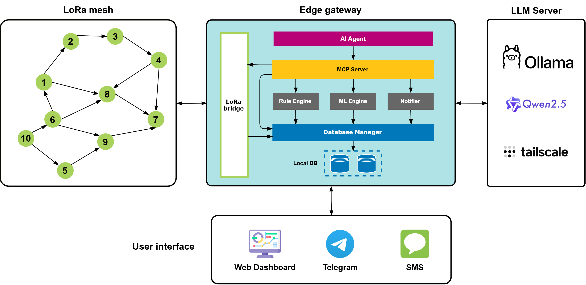

<div align="center">

# 🌾 AgriMeshAI

**Hybrid Edge-Server Smart Agriculture Platform**

[](LICENSE)
[](https://www.python.org/)
[](https://www.espressif.com/)
[-orange)](https://ollama.com/)
[]()

*LoRa mesh networking · Statistical anomaly detection · MCP tool orchestration · Event-driven architecture*

[Overview](#overview) · [Architecture](#system-architecture) · [Features](#key-capabilities) · [Tech Stack](#technology-stack) · [Project Structure](#project-structure)

</div>

---

## Overview



AgriMeshAI is an intelligent edge computing platform for smart agriculture. It connects farmers with distributed IoT devices through natural language, enabling autonomous monitoring, statistical anomaly detection, and multi-channel alerting.

The platform uses a **hybrid architecture**: the edge gateway handles real-time sensing and alerting autonomously (fully offline-capable), while a separate LLM server provides natural language interaction and contextual alert explanations over Tailscale VPN.

The platform integrates:

- **ESP32-based sensor & actuator nodes** deployed across the field
- **LoRa mesh communication** for long-range coverage (868 MHz)
- **Edge Gateway** (Jetson Nano / RPi) — runs 24/7 with sensor polling, SQLite storage, statistical anomaly detection, and alert dispatch
- **LLM Server** (separate PC with RTX 3050) — Qwen2.5 7B via Ollama over Tailscale VPN
- **MCP Server** for unified tool orchestration between AI and hardware
- **Event-driven architecture** — EventBus + EventQueueManager for decoupled module communication
- **3 Statistical Detectors** — MovingAverage (±σ), RateOfChange (regression), StuckSensor (variance)
- **Enrichment Pipeline** — auto-appends 24h historical context and LLM explanation to alerts
- **Runtime Config** — enable/disable detectors and tune parameters without restart
- **Multi-channel alerts** — Console, Telegram Bot, Webhook, and SMS

---

## System Architecture

```
┌─────────────────┐       LoRa Mesh (868 MHz)       ┌──────────────────┐
│  ESP32 Nodes    │◄──────────────────────────────► │  LoRa Gateway    │
│  (Sensors +     │                                 │  (ESP32 Bridge)  │
│   Actuators)    │                                 └────────┬─────────┘
└─────────────────┘                                          │ UART 115200
                                                             ▼
┌──────────────────────────────────────────────────────────────────────┐
│                        Edge Gateway (Jetson Nano)                    │
│                                                                      │
│  ┌──────────┐  ┌──────────┐  ┌──────────┐  ┌──────────┐  ┌────────┐  │
│  │ Sensor   │  │ Database │  │ ML       │  │ Rule     │  │Notify  │  │
│  │ Poller   │─►│ Manager  │─►│ Detector │─►│ Engine   │─►│Manager │  │
│  │(Polling) │  │(SQLite   │  │(3 stats) │  │(8 rules) │  │(4 ch.) │  │
│  └──────────┘  │ WAL)     │  └──────────┘  └──────────┘  └────────┘  │
│                └──────────┘                                          │
│  ┌─────────────────────────────────────────────────────────────────┐ │
│  │ EnrichmentPipeline — 24h history + LLM explanation (best-effort)│ │
│  └─────────────────────────────────────────────────────────────────┘ │
└──────────────────────────┬───────────────────────────────────────────┘
                           │ Tailscale VPN
                           ▼
┌──────────────────────────────────────────────────────────────────────┐
│                  LLM Server (PC + RTX 3050)                          │
│  Ollama — Qwen2.5 7B — /v1/chat/completions                          │
└──────────────────────────────────────────────────────────────────────┘
```

---

## Key Capabilities

### Natural Language Farm Control

Interact with your farm using plain language via the AI agent:

```
"Turn on irrigation zone A for 10 minutes."
"Show soil moisture trends from the last week."
"Do I need to irrigate tomorrow?"
"What's the battery status of all sensors?"
```

### AI Agent (via Remote LLM Server)

- LLM inference via Ollama (Qwen2.5 7B) over Tailscale VPN — not running on ESP32
- edge-agent framework — zero-dependency, vendored Python
- Multi-step reasoning and tool calling via MCP tools
- Context-aware decision support with on-demand activation
- Graceful degradation when VPN is down (gateway continues offline)
- Supports agent types: agent, guardrail, router, evaluator, fallback

### Statistical Anomaly Detection (3 Detectors)

| Detector | Method | Configurable |
|----------|--------|-------------|
| **M01 — MovingAverage** | Rolling window ±σ baseline deviation | window_size, threshold_sigma |
| **M02 — RateOfChange** | Linear regression slope (units/hour) | window_minutes, max_rate |
| **M03 — StuckSensor** | Variance-based stuck detection | window_hours, threshold_var |

All detectors run on the **Edge Gateway**, not on ESP32 nodes. Runtime configuration via EventBus `config_updated` event. Health reporting via `detector_health` event (60s interval).

### Real-Time Rule Engine

- 8 configurable rules: threshold, rate-of-change, stuck sensor, missing data
- Rule IDs: R01–R09 (temperature, humidity, moisture, battery, connectivity)
- Multi-tier alert levels: `INFO` → `WARNING` → `CRITICAL`
- Alert deduplication with 5-minute cooldown
- Missing data detection (timer-based, every 5 minutes in daemon mode)

### Alert Enrichment Pipeline

- Every anomaly alert is enriched with 24h historical sensor context
- LLM (Qwen2.5) generates Vietnamese explanation with recommended action
- Offline queue: alerts stored immediately, enrichment retried (3×: 30s, 2min, 5min)
- Alerts **never** blocked waiting for enrichment

### Multi-Channel Notifier

- **Console** — always on, severity-colored output to stderr
- **Telegram** — push notifications via Bot API
- **Webhook** — HTTP POST JSON to any endpoint
- **SMS** — GSM module (SIM800/SIM7600) via serial AT commands

### Runtime Detector Configuration

- Enable/disable individual detectors without restart
- Tune parameters (threshold_sigma, max_rate, window_size) at runtime
- Query detector health status per detector
- All via EventBus `config_updated` event

### LoRa Mesh Networking

- Long-range communication (868 MHz) across the field
- Self-healing mesh routing (via LoRaMesher library)
- Ultra-low-power sensor nodes with solar + LiPo battery backup
- 3 firmware targets: sensor_node, actuator_node, lora_gateway

---

## Test Status

| Suite | Tests | Coverage |
|-------|-------|----------|
| Unit tests | 44 | All 3 detectors, orchestrator, enrichment, runtime config |
| Integration tests | 11 | E2E flow, SystemManager lifecycle, real LLM enrichment |
| **Total** | **55 passing** | |

Run: `python -m pytest tests/ tests/integration/ -v`

---

## Technology Stack

| Domain | Technologies |
|--------|-------------|
| **Embedded** | ESP32-S3, FreeRTOS, SX1262 LoRa transceiver, DHT22, BH1750, capacitive soil sensors |
| **Edge Gateway** | Jetson Nano / Raspberry Pi, Python 3.10+, SQLite (WAL mode), aiosqlite |
| **AI & LLM** | Ollama, Qwen2.5 7B, edge-agent, MCP Python SDK |
| **Statistical Detection** | MovingAverage (±σ), RateOfChange (regression), StuckSensor (variance) |
| **Communication** | Serial (UART 115200 baud), MQTT (paho-mqtt), Tailscale VPN |
| **Event System** | EventBus (sync), EventQueueManager (async, DLQ, retry) |
| **User Interface** | MCP Streamable HTTP (port 8374), Telegram Bot, SMS, Console |
| **Testing** | pytest, pytest-asyncio, 55 tests (44 unit + 11 integration) |

---

## Project Status

| Component | Status |
|-----------|--------|
| ESP32 Firmware (3 targets) | ✅ Implemented |
| Edge Gateway (gateway loops) | ✅ Implemented |
| Statistical Detectors (M01-M03) | ✅ Implemented |
| Runtime Config & Health | ✅ Implemented |
| Alert Enrichment Pipeline | ✅ Implemented |
| MCP Server (fleet tools) | ✅ Implemented |
| Rule Engine (R01-R09) | ✅ Implemented |
| Multi-Channel Notifier | ✅ Implemented |
| Unit Tests (44) | ✅ Passing |
| Integration Tests (11) | ✅ Passing |
| CI/CD Pipeline | ❌ Not started |
| Production Deployment | ❌ Not started |
| Backend Server (5.Server/) | ⏸️ Skeleton |
| Mobile App (4.Mobile-app/) | ⏸️ Placeholder |

---

## License

This project is licensed under the terms included in the [LICENSE](LICENSE) file.
