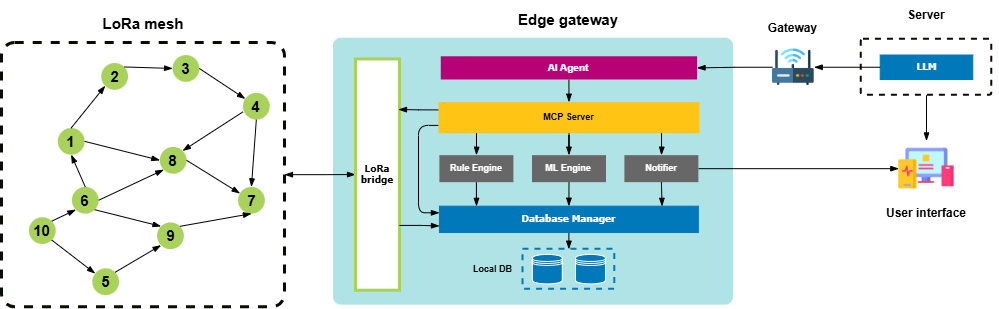

<div align="center">

# 🌾 AgriMeshAI

**Edge AI-Powered Smart Agriculture Platform**

[](LICENSE)
[](https://www.python.org/)
[](https://www.espressif.com/)
[-orange)](https://ollama.com/)

*LoRa mesh networking · On-device AI agents · MCP tool orchestration · Event-driven edge architecture*

[Overview](#overview) · [Architecture](#system-architecture) · [Features](#key-capabilities) · [Tech Stack](#technology-stack) · [Getting Started](#getting-started) · [Project Structure](#project-structure)

</div>

---

## Overview

AgriMeshAI is an intelligent edge computing platform for smart agriculture. It connects farmers with distributed IoT devices through natural language, enabling autonomous monitoring, anomaly detection, and alerting — all operating **fully offline at the edge**.

The platform integrates:

- **ESP32-based sensor & actuator nodes** deployed across the field
- **LoRa mesh communication** for long-range coverage
- **On-device AI Agent** powered by a local LLM (Qwen2.5 via Ollama) on a separate PC, connected via Tailscale
- **MCP Server** for unified tool orchestration between AI and hardware
- **Event-driven architecture** — EventBus + EventQueueManager for decoupled module communication
- **24/7 Rule Engine & Notifier** for real-time anomaly detection and multi-channel push notifications
- **Multi-channel alerts** — Console, Telegram Bot, Webhook, and SMS

---

## System Architecture



---

## Key Capabilities

### Natural Language Farm Control

Interact with your farm using plain language:

```
"Turn on irrigation zone A for 10 minutes."
"Show soil moisture trends from the last week."
"Do I need to irrigate tomorrow?"
"What's the battery status of all sensors?"
```

### Edge AI Agent

- Local LLM inference (Qwen2.5 via Ollama) over Tailscale VPN
- edge-agent framework — zero-dependency, vendored Python
- Multi-step reasoning and tool calling via MCP tools
- Context-aware decision support with on-demand activation
- Supports agent types: agent, guardrail, router, evaluator, fallback

### Event-Driven Architecture

- **EventBus** — lightweight pub/sub for decoupled inter-module communication
- **EventQueueManager** — async queued event dispatcher with DLQ, retry (3×), and timeout
- Modules publish events without knowing who subscribes

### Real-Time Rule Engine

- 8 configurable rules: threshold, rate-of-change, stuck sensor, missing data
- Rule IDs: R01–R09 (temperature, humidity, moisture, battery, connectivity)
- Multi-tier alert levels: `INFO` → `WARNING` → `CRITICAL`
- Alert deduplication with 5-minute cooldown
- Missing data detection (timer-based, every 5 minutes in daemon mode)

### Multi-Channel Notifier

- **Console** — always on, severity-colored output to stderr
- **Telegram** — push notifications via Bot API (configurable via env vars)
- **Webhook** — HTTP POST JSON to any endpoint
- **SMS** — GSM module (SIM800/SIM7600) via serial AT commands

### Predictive Analytics & Anomaly Detection

| Module | Method | Purpose |
|---|---|---|
| Statistical anomaly detection | ±σ baseline deviation (SQLite) | Deviation, drift from rolling baseline |
| Rule engine threshold | ±3σ moving average | Deviation, rate-of-change, stuck sensor detection |
| Fleet tools | `search_anomalies` MCP tool | Cross-sensor baseline analysis |

### LoRa Mesh Networking

- Long-range communication (433 / 868 / 915 MHz) across the field
- Self-healing mesh routing with automatic node discovery
- Ultra-low-power sensor nodes with solar + LiPo battery backup

---

## Technology Stack

| Domain | Technologies |
|---|---|
| **Embedded** | ESP32-S3, FreeRTOS, SX1262 LoRa transceiver, DHT22, BH1750, capacitive soil sensors |
| **Edge Gateway** | Jetson Nano / Raspberry Pi, Python 3.10+, SQLite (WAL mode), aiosqlite |
| **AI & LLM** | Ollama, Qwen2.5 7B, edge-agent, MCP Python SDK |
| **Communication** | Serial (UART 115200 baud), MQTT (paho-mqtt), Tailscale VPN |
| **Event System** | EventBus (sync), EventQueueManager (async, DLQ, retry) |
| **User Interface** | MCP Streamable HTTP (port 8374), Telegram Bot, SMS, Console |
---

## License

This project is licensed under the terms included in the [LICENSE](LICENSE) file.
