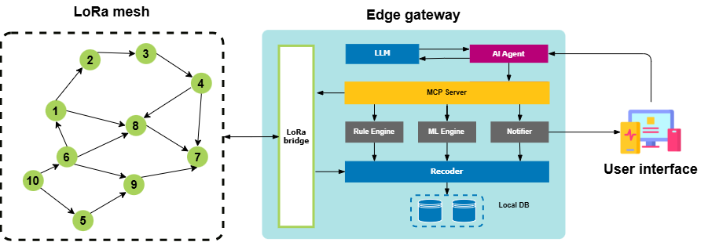

<div align="center">

# 🌾 AgriMeshAI

**Edge AI-Powered Smart Agriculture Platform**

[](LICENSE)
[](https://www.python.org/)
[](https://www.espressif.com/)
[-orange)](https://ollama.com/)

*LoRa mesh networking · On-device AI agents · MCP tool orchestration · Predictive analytics*

[Overview](#overview) · [Architecture](#system-architecture) · [Features](#key-capabilities) · [Tech Stack](#technology-stack) · [Getting Started](#getting-started) · [Project Structure](#project-structure)

</div>

---

## Overview

AgriMeshAI is an intelligent edge computing platform for smart agriculture. It connects farmers with distributed IoT devices through natural language, enabling autonomous monitoring, irrigation control, anomaly detection, and predictive decision-making — all operating **fully offline at the edge**.

The platform integrates:

- **ESP32-based sensor & actuator nodes** deployed across the field
- **LoRa mesh communication** with self-healing routing for long-range coverage
- **On-device AI Agent** powered by a local LLM (Qwen2.5 via Ollama)
- **MCP Gateway (Jeltz)** for unified tool orchestration between AI and hardware
- **24/7 Rule Engine & ML Inference** for real-time anomaly detection and prediction
- **Multi-channel UI** — Web, Telegram Bot, SMS, and BLE

---

## System Architecture



---

## Key Capabilities

### Natural Language Farm Control

Interact with your farm using plain language:

```
"Turn on irrigation zone A for 10 minutes."
"Show soil moisture trends from the last week."
"Do I need to irrigate tomorrow?"
"What's the battery status of all sensors?"
```

### Edge AI Agent

- Local LLM inference (Qwen2.5 via Ollama) — no internet required
- LangChain-based multi-step reasoning and tool calling
- Context-aware decision support with safety validation
- On-demand activation to minimize resource usage

### LoRa Mesh Networking

- Long-range communication (433 / 868 / 915 MHz) across the field
- Self-healing mesh routing with automatic node discovery
- Ultra-low-power sensor nodes with solar + LiPo battery backup
- Reliable actuator command delivery with acknowledgment

### Predictive Analytics & Anomaly Detection

| Module | Method | Purpose |
|---|---|---|
| Univariate anomaly detection | ±3σ moving average | Deviation, rate-of-change, stuck sensor detection |
| Multivariate anomaly detection | Isolation Forest | Cross-sensor correlation analysis |
| Soil moisture prediction | LightGBM | Proactive irrigation recommendations |
| Local weather forecasting | LSTM-TCN | Microclimate predictions from NASA POWER data |
| Battery life prediction | Linear regression | Maintenance scheduling |

### Real-Time Rule Engine

- 8 configurable threshold rules (temperature, humidity, battery, connectivity)
- Multi-tier alert levels: `INFO` → `WARNING` → `CRITICAL` with push notifications
- Automated safety responses — emergency stop, actuator timeout

### Safety & Reliability

- **3-layer safety architecture**: hardware watchdog → logic validator → semantic AI check
- Human-in-the-loop confirmation required for all actuator commands
- `ActuatorLock` prevents concurrent conflicting commands
- Graceful offline fallback — all critical functions operate without internet

---

## Technology Stack

| Domain | Technologies |
|---|---|
| **Embedded** | ESP32-S3, FreeRTOS, SX1262 LoRa transceiver, DHT22, BH1750, capacitive soil sensors |
| **Edge Gateway** | Jetson Nano / Raspberry Pi, Python, SQLite (WAL mode), MQTT |
| **AI & ML** | Ollama, Qwen2.5, LangChain, MCP, LightGBM, Scikit-learn, ONNX Runtime |
| **Communication** | LoRa Mesh (LoRaMesher), UART (115200 baud), SPI, REST API |
| **User Interface** | Web UI (port 8374), Telegram Bot, SMS, BLE |

---

## Getting Started

### Prerequisites

- Jetson Nano or Raspberry Pi (edge gateway)
- ESP32-S3 nodes with LoRa transceivers
- Python 3.10+
- [Ollama](https://ollama.com/) installed on the gateway

### 1. Install Ollama and pull the LLM model

```bash
curl -fsSL https://ollama.com/install.sh | sh
ollama pull qwen2.5:1.5b
```

### 2. Run setup

```bash
./scripts/setup.sh
```

### 3. Start the agent

```bash
./scripts/start.sh
```

The Web UI will be available at `http://localhost:8374`.

---

## Project Structure

```
AgriMeshAI/
├── config/
│   └── models.yaml               # ML model configuration
├── doc/
│   ├── assets/
│   │   └── system_architecture.png
│   └── system-design.md          # Detailed system design document
├── scripts/
│   ├── setup.sh                  # Environment setup script
│   └── start.sh                  # Agent startup script
├── README.md
└── requirements.txt
```

---

## License

This project is licensed under the terms included in the [LICENSE](LICENSE) file.