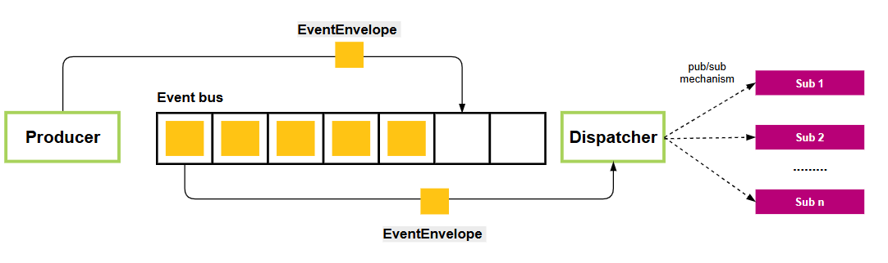

# Event Bus — Thiết kế module

> **Module:** `event_bus/`
> **Phiên bản:** 1.0
> **Ngày:** 12/06/2026

---

## 1. Tổng quan

### Mục đích

`event_bus` là module hạ tầng cho giao tiếp bất đồng bộ giữa các module trong hệ thống:

- **EventBus** — pub/sub core: module phát sự kiện, module khác lắng nghe
- **EventQueueManager** — async queue: non-blocking publish, retry, dead letter queue

Thiết kế tách biệt: **publisher** không cần biết **subscriber**, **subscriber** không cần biết **publisher**.

### Hai cơ chế

Module có 2 cơ chế hoạt động song song, mỗi cơ chế phục vụ một mục đích khác nhau:

#### EventBus (bus.py) — Pub/sub cho consumer

```
rule_engine → bus.on("alert_triggered", evaluate)     ← subscribe
notifier   → bus.on("alert_triggered", send_alert)    ← subscribe
server     → await bus.emit("alert_triggered", ...)    ← emit
```

- Handler được gọi **đồng bộ** ngay trong luồng `emit()`
- Không retry, không queue, không timeout
- **Dùng cho:** Module cần phản hồi ngay khi có sự kiện (RuleEngine, Notifier)
- **Không dùng cho:** Module publish (server.py, recorder.py) — vì blocking

#### EventQueueManager (manager.py) — Queue cho producer

```
server.py   → await queue.publish("reading_recorded", ...)   ← non-blocking
recorder.py → await queue.publish("reading_recorded", ...)   ← non-blocking
```

- Handler được gọi **bất đồng bộ** qua worker loop
- Có retry per-handler, timeout, dead letter queue
- **Dùng cho:** Module publish không muốn block (server.py, recorder.py)
- **Không dùng cho:** Consumer — vì queue không trả kết quả ngay

#### Tại sao cần cả hai?

| Tình huống | Nếu chỉ có pub/sub | Nếu chỉ có queue |
|------------|-------------------|------------------|
| `reading_recorded` → telegram + log | Telegram chậm → log bị block | Ổn — retry per-handler |
| `alert_triggered` → console | Ổn (console nhanh) | Console bị delay vô ích |
| Server tool call → record + evaluate | Block nếu evaluate lâu | Ổn — non-blocking |
| Telegram fail → retry | Không có retry | Có retry + DLQ |

**Kết luận:** Pub/sub cho consumer cần phản hồi ngay. Queue cho producer không muốn block. Hai cơ chế bổ sung cho nhau, không thay thế.

### Vị trí trong hệ thống

```
publisher (server.py, recorder.py)
    │
    ▼ push queue (non-blocking)
    │
EventQueueManager
    │
    ├── worker loop → gọi từng handler (retry per-handler)
    │
    ├── thành công → stats["processed"]++
    └── thất bại → DeadLetter (uuid, handler, error, attempts)

Consumer (rule_engine, notifier) subscribe qua EventBus
    └── bus.on("alert_triggered", handler) — trực tiếp, không qua queue
```

### Ràng buộc thiết kế

- Zero external dependencies — chỉ dùng `asyncio` stdlib
- Non-blocking publish — `put_nowait()` + backpressure signal
- Retry per-handler — một handler fail không kéo theo handler khác
- Dead Letter Queue — event fail được lưu để inspect/retry sau
- Handler timeout — mỗi handler có timeout riêng (mặc định 10s)

---

## 2. Kiến trúc



### Các thành phần

```
event_bus/
├── __init__.py      Export: EventBus, EventQueueManager, DeadLetter
├── bus.py           EventBus — pub/sub core
└── manager.py       EventQueueManager — queue + retry + DLQ
```

### Luồng dữ liệu chi tiết

```
publisher (server.py, recorder.py)
    │
    ▼
EventQueueManager.publish(event, **data)
    │
    ├── asyncio.Queue.put_nowait()          ← non-blocking
    │   ├── QueueFull → return False        ← backpressure
    │   └── success → return True
    │
    ▼
worker_loop (background asyncio task)
    │
    ├── asyncio.wait_for(queue.get(), timeout=1.0)
    │
    ▼
_dispatch(envelope)
    │
    ├── handler_1 → _deliver → success
    │   └── retry nếu fail → exponential backoff (1s, 2s, 4s)
    │       └── hết retry → DeadLetter
    │
    ├── handler_2 → _deliver → success      ← không bị retry của handler_1 ảnh hưởng
    │
    └── handler_3 → _deliver → fail → DeadLetter
```

---

## 3. Các thành phần

### 3.1 bus.py — EventBus (pub/sub core)

```python
class EventBus:
    def __init__(self)

    def on(event: str, handler: Handler)           # đăng ký
    def off(event: str, handler: Handler)           # huỷ đăng ký
    async def emit(event: str, **data: Any)         # phát đồng bộ
```

**Công dụng:** Module consumer dùng để subscribe. `emit()` gọi handler đồng bộ — tất cả handler chạy sequence, không retry, không queue.

**Sử dụng bởi:** `RuleEngine`, `NotifierManager` subscribe vào `alert_triggered`.

### 3.2 manager.py — EventQueueManager

```python
class EventQueueManager:
    def __init__(self, maxsize=100, max_retries=3, handler_timeout=10.0)
```

**Tham số khởi tạo:**

| Tham số | Mặc định | Ý nghĩa |
|---------|----------|---------|
| `maxsize` | 100 | Kích thước tối đa của queue (backpressure) |
| `max_retries` | 3 | Số lần retry tối đa (tổng attempt = max_retries + 1) |
| `handler_timeout` | 10.0 | Timeout mỗi lần gọi handler (giây) |

**Public API:**

```python
    # Publisher
    async def publish(event: str, **data) -> bool      # non-blocking, return False nếu queue đầy

    # Subscriber
    def subscribe(event: str, handler: Handler)          # đăng ký handler

    # Lifecycle
    async def start()                                     # chạy worker background
    async def stop()                                      # drain queue + stop worker

    # DLQ management
    def get_dlq() -> list[DeadLetter]                    # inspect
    async def retry_dlq(max_retries=None) -> int         # retry tất cả, trả số lượng success
    async def retry_event(event_id: str, max_retries=None) -> bool  # retry 1 event
    def clear_dlq()                                       # xoá DLQ

    # Monitoring
    @property
    def stats() -> dict                                   # published, processed, failed, dlq, queue_size, dlq_size
```

### 3.3 DeadLetter

```python
@dataclass
class DeadLetter:
    id: str                          # uuid — để retry_event() xác định
    event: str                       # tên event ("reading_recorded")
    data: dict                       # payload {"device_id": "s1", "value": 45.0}
    handler_name: str                # handler.__name__ — để inspect
    handler: Callable | None = None  # reference thật — để retry_dlq() gọi lại
    failed_at: datetime              # thời điểm fail
    last_error: str                  # str(exception) — "Connection refused"
    attempts: int                    # số lần đã thử (max_retries + 1)
```

**Lưu ý:** `handler` reference được lưu để retry không cần lookup lại. Khi app restart, reference mất — cần logic phục hồi (chưa implement).

---

## 4. Quyết định thiết kế

### Non-blocking publish

`publish()` dùng `Queue.put_nowait()` — không chờ. Nếu queue đầy, trả `False` (backpressure DROP policy). Publisher không bao giờ bị block.

### Retry per-handler, không phải per-event

```
publish("reading_recorded", ...)
  ├── telegram_handler → fail → retry 3× → DLQ       ← chỉ handler này retry
  ├── sqlite_handler   → success                      ← không bị gọi lại
  └── log_handler      → success                      ← không bị gọi lại
```

### Dead Letter Queue manual drain

DLQ không tự động retry — tránh loop vô hạn. Caller (farmer/service) chủ động gọi `retry_dlq()` hoặc `retry_event()` sau khi đã fix nguyên nhân.

### Exponential backoff

```
Retry 1: sleep = 2^0 = 1s
Retry 2: sleep = 2^1 = 2s
Retry 3: sleep = 2^2 = 4s
```

### Queue drain trước stop

`stop()` gọi `queue.join()` đợi tất cả event trong queue được xử lý trước khi cancel worker — tránh mất event.

### Own registry thay vì dùng bus.emit()

`EventQueueManager` có `_handlers` riêng, không dùng `EventBus.emit()` để dispatch. Lý do:
- Kiểm soát retry riêng từng handler
- Không ảnh hưởng đến consumer đã subscribe qua `bus.on()`
- Dễ test độc lập

---

## 5. Backpressure strategy

| Tình huống | Hành vi |
|------------|---------|
| Queue chưa đầy | Push event, worker xử lý ngay |
| Queue đầy (maxsize) | `publish()` return `False`, event bị drop |
| Handler chậm | Queue tích tụ → đầy → drop event mới |
| Handler crash | Retry → DLQ → không ảnh hưởng queue |

Queue maxsize = 100 là giá trị phù hợp cho Jetson Nano.
Quá nhỏ → drop nhiều, quá lớn → tốn RAM.

---

## 6. Monitoring

```python
manager.stats
# {
#     "published": 1500,     # total events published
#     "processed": 1495,     # events processed successfully
#     "failed": 0,           # publish failed (queue full)
#     "dlq": 5,              # events in dead letter queue
#     "queue_size": 3,       # current queue depth
#     "dlq_size": 5,         # DLQ depth
# }
```

---

## 7. Giới hạn

- **Persistence chưa có** — event mất khi app crash. Có thể thêm JSONL WAL.
- **Wildcard pattern chưa có** — chỉ match exact event name.
- **Handler priority chưa có** — handlers chạy theo thứ tự subscribe.
- **DLQ handler reference mất khi restart** — cần logic phục hồi.
- **Không có event history** — subscriber mới không nhận được event cũ.
- **Worker không concurrent** — handler chạy tuần tự trong một worker task.

---

## 8. Ví dụ

### Publisher (server.py)

```python
from event_bus import EventQueueManager

queue = EventQueueManager(maxsize=100)
await queue.start()

# Non-blocking publish
ok = await queue.publish("reading_recorded",
    device_id="sensor_01",
    sensor_id="temperature",
    value=32.5,
    unit="celsius",
)
if not ok:
    logger.warning("event queue full, reading dropped")
```

### Consumer (rule_engine.py)

```python
from event_bus import EventBus

bus = EventBus()
bus.on("alert_triggered", self._send_alert)
```

### DLQ management

```python
# Kiểm tra event fail
dlq = manager.get_dlq()
for dl in dlq:
    print(f"{dl.id}: {dl.event} → {dl.last_error}")

# Retry tất cả
await manager.retry_dlq()

# Retry 1 event cụ thể
await manager.retry_event(event_id)
```

---

## Tham khảo

- asyncio.Queue — docs.python.org
- Python async/await — docs.python.org
- Apache Kafka pattern (adapted for edge)
